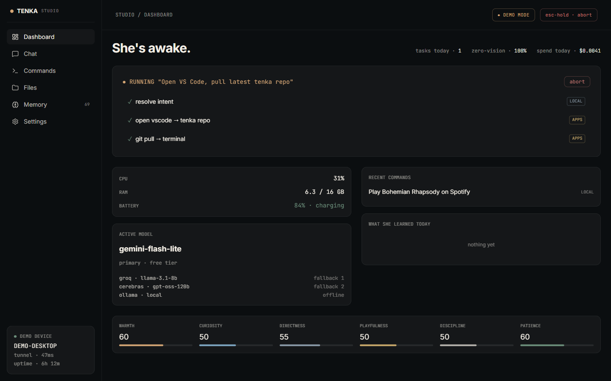
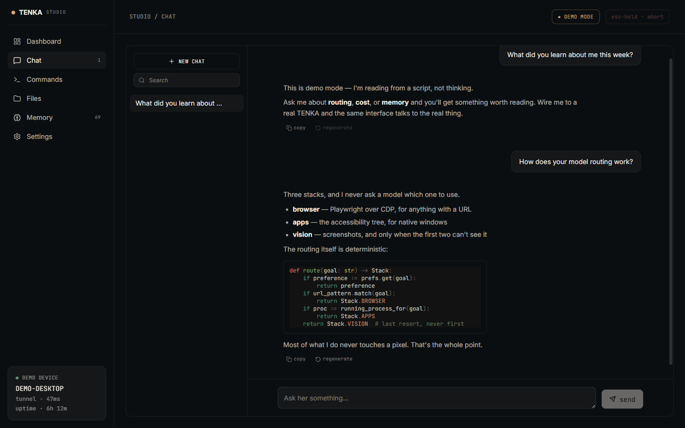
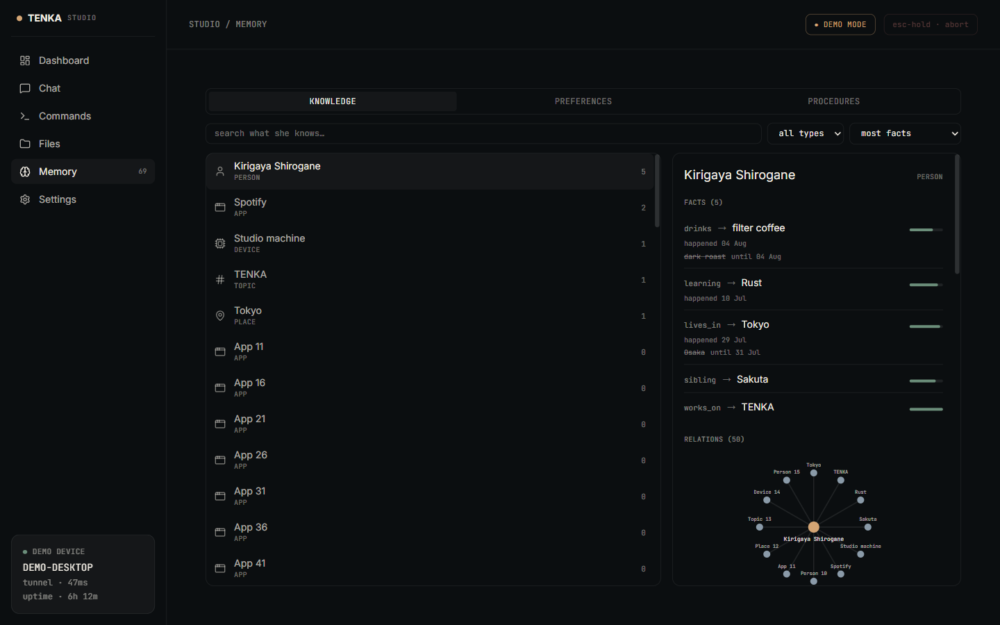
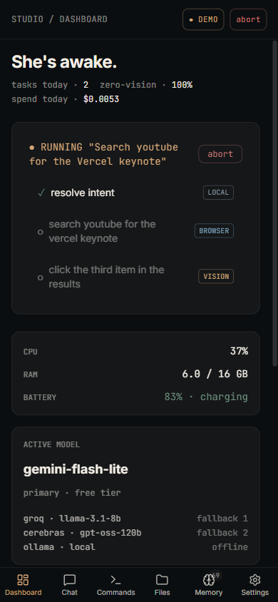

<p align="center">
  
</p>

<h1 align="center">TENKA Studio</h1>

<p align="center">
  The web dashboard for <strong>TENKA</strong>, a local-first desktop AI assistant
  that runs on your own machine.
</p>

<p align="center">
  <a href="https://tenka-studio.vercel.app"><strong>Live demo</strong></a>
  &nbsp;·&nbsp;
  <a href="https://github.com/Om-Khode/TENKA">The assistant</a>
  &nbsp;·&nbsp;
  <a href="#getting-started">Getting started</a>
</p>

<p align="center">
  
  
  
  
  
</p>

<p align="center">
  
</p>

Studio is a frontend and an API client — nothing more. It contains no AI logic,
no automation, and makes no model calls of its own. Every intelligent behaviour
it displays belongs to the Python assistant it talks to over loopback.

---

## Two route trees, one layout

| Tree | Data source | Needs a backend? |
| --- | --- | --- |
| `/demo/*` | scripted Zustand stores, no network | no |
| `/app/*` | the TENKA daemon over HTTP + WebSocket | yes |

The demo layout **is** the live layout. `/demo` and `/app` render the same
components; only the data source differs. That is the point of the split — the
deployed demo is not a mockup of the product, it is the product on invented data.

Both trees carry the same six pages: dashboard, chat, commands, files, memory,
and settings. `/connect` is the door into the live tree; `/pair` redeems a
pairing code from a phone.

Chat renders markdown and highlights code, so an answer about her own routing
arrives as something readable rather than a wall of text:



Memory is the page that shows what a local-first assistant actually buys you.
Facts carry validity, so a superseded value is struck through and dated rather
than overwritten, and every entity keeps its own relation graph:



The same layout collapses to a phone — a bottom nav replaces the sidebar, and
the running task keeps its per-step stack badges:

<p align="center">
  
</p>

## The public build serves the demo only

A page served over HTTPS cannot fetch a visitor's `http://127.0.0.1` daemon —
mixed content, plus Private Network Access. So the deployed build walls the live
tree off rather than shipping a broken one: `/app/*` and `/connect` answer a real
HTTP 404.

That switch is `NEXT_PUBLIC_DEMO_ONLY=1`, read at **build** time and owned by
`services/deployment.ts`. Unset it and you get the full app. See
[`docs/deploy.md`](./docs/deploy.md).

## The demo data is a deliberate fiction

`store/memory-scripts.ts` and `demoSystemSeed()` describe a person — a name, a
relocation, a sibling, enrolled voices and faces. **All of it is invented.** It
used to be the developer's own life, which was harmless on one laptop and a
published fact sheet the moment this became a URL.

If you add a realistic-looking row, invent it too.

## Stack

Next.js 15 (App Router) · React 19 · TypeScript · Tailwind v4 · Zustand ·
Radix primitives · Framer Motion · shiki · Vitest + Testing Library + MSW

Fonts are self-hosted through `@fontsource` so the demo build makes no
third-party requests.

<h2 id="getting-started">Getting started</h2>

```bash
npm install
npm run dev
```

Then open [http://localhost:3000](http://localhost:3000). `/demo` works
immediately with no backend. `/app` needs TENKA's daemon listening on
`http://127.0.0.1:8787`.

To serve the public shape locally:

```powershell
$env:NEXT_PUBLIC_DEMO_ONLY="1"; npm run build
npm start
```

## Gates

Four, all of which must pass:

```bash
npm run typecheck     # tsc --noEmit
npm run lint          # eslint
npm run test          # vitest run
npm run api:check     # types/api.d.ts matches openapi.json byte-for-byte
```

`npm run api:check` is the one people forget. `types/api.d.ts` is **generated**
from `openapi.json` — the daemon's OpenAPI contract — by `npm run api:types`.
Hand-editing either is how the client and the daemon drift apart. Both files are
pinned to LF in `.gitattributes` so `autocrlf` cannot fake a diff.

## Layout

```
app/          routes: /, /demo/*, /app/*, /connect, /pair
components/   UI, split demo/live where the data source differs
services/     API client, repositories, the demo/live seam
store/        Zustand stores and the demo scripts
lib/          formatting, refusal copy, shiki, invalidation
types/        api.d.ts (generated), route tables, session shapes
scripts/      build-bundled.mjs, check-api-types.mjs
docs/         PRD and the deploy runbook
```

Tests sit beside the code they cover — 150 `*.test.ts(x)` files.

## The assistant itself

TENKA — the Python assistant, the automation tiers, the LLM routing, and the
daemon this dashboard talks to — lives in its own repository:
**[Om-Khode/TENKA](https://github.com/Om-Khode/TENKA)**.

Studio is a client. It is useful on its own only as the demo; the live tree
needs that daemon running on the same machine.

## License

Apache License 2.0 — see [LICENSE](./LICENSE).
